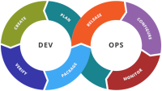

# DevOps Score

*La classifica delle migliorai relatà DevOps italiane*

---

# Whitepaper

## Introduzione

Il punteggio DevOps fornisce una valutazione della maturità e delle capacità DevOps di un'azienda. Questo punteggio viene calcolato analizzando i dati che le aziende condividono pubblicamente attraverso il web e i social media. Valutiamo vari fattori come l'adozione di pratiche DevOps, l'automazione, la cultura aziendale e l'innovazione tecnologica.

In questo documento, descriviamo come viene eseguito il calcolo del punteggio DevOps e quali indicatori vengono utilizzati per determinare il risultato finale.

## Indicatori Considerati

Il punteggio DevOps è basato sui seguenti indicatori, ciascuno valutato con un punteggio da 1 a 10:

- **Presenza su GitHub:** La presenza di repository pubblici su GitHub e la loro attività, come numero di commit, pull request, e gestione delle issue.
- **Presenza su GitLab:** La presenza di repository pubblici su GitLab, con un focus sulle pipeline CI/CD e la collaborazione all'interno dei progetti.
- **Sistemi di CI/CD:** L'uso di sistemi di integrazione continua (CI) e distribuzione continua (CD), valutando l'efficienza, la frequenza di esecuzione e l'automazione dei processi.
- **Processi di testing:** L'adozione e la maturità dei processi di testing automatici e manuali, inclusi test unitari, funzionali e di integrazione.
- **Social network engagement:** L'attività dell'azienda sui social media, in particolare in relazione a discussioni su DevOps, automazione e nuove tecnologie, come indicatore della cultura aziendale e dell'innovazione.

## Calcolo del Punteggio

Il punteggio DevOps finale viene calcolato sommando i punteggi ottenuti in ciascuno dei cinque indicatori elencati sopra. Ogni indicatore è valutato da 1 a 10, dove:

- **1** indica una scarsa adozione o presenza limitata in quell'area;
- **10** indica un'adozione completa e di eccellenza.

Esempio di calcolo:

| Indicatore               | Punteggio |
|--------------------------|-----------|
| Presenza su GitHub        | 8         |
| Presenza su GitLab        | 6         |
| Sistemi di CI/CD          | 9         |
| Processi di testing       | 7         |
| Social network engagement | 5         |
| **Totale**                | **35/50** |

Il punteggio totale viene normalizzato in una scala percentuale (da 0 a 100) per fornire una valutazione complessiva. Nell'esempio sopra, l'azienda ha ottenuto un punteggio di 35 su un massimo di 50, che corrisponde a un punteggio DevOps finale del **70%**.

## Interpretazione del Punteggio

Un punteggio DevOps più alto indica un'azienda più avanzata nell'adozione delle pratiche DevOps, con processi automatizzati e una forte cultura tecnologica. Tuttavia, un punteggio basso può rappresentare un'opportunità di miglioramento in aree critiche come l'automazione, il testing e la collaborazione.

### Classificazione del Punteggio

- **90-100%**: Adozione eccellente delle pratiche DevOps, innovazione continua.
- **70-89%**: Adozione buona, con alcune aree che potrebbero beneficiare di miglioramenti.
- **50-69%**: Adozione moderata, diverse aree critiche che necessitano attenzione.
- **Sotto il 50%**: Scarsa adozione, necessità di revisione e miglioramento significativo.

## Conclusione

Il calcolo del punteggio DevOps offre un indicatore chiaro della maturità DevOps di un'azienda. Esso aiuta a identificare punti di forza e debolezze nelle pratiche DevOps e fornisce indicazioni su come migliorare la qualità e l'efficienza delle operazioni aziendali.

## License
